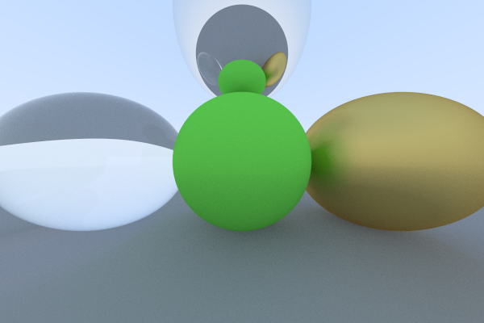

# raytrace-cli

Ray-tracing, but in CLI.

This is a practice project to improve my understanding of Peter Shirley's great book [_Ray Tracing in One Weekend_](https://raytracing.github.io/books/RayTracingInOneWeekend.html).

My goal is to build a ray tracing demo running in the terminal that uses ASCII art for painting. Support of classical outputs such as images might be included, but that's not part of the plan. It's a toy project, and I hope you have fun.

# Current Outcome

Please note that the image above is transformed to `.png` format using `ffmpeg` to reduce its size. Raw output of this renderer is in the `.ppm` format for simplicity of implementation, as I do not want to dig too deep into image encoding.
